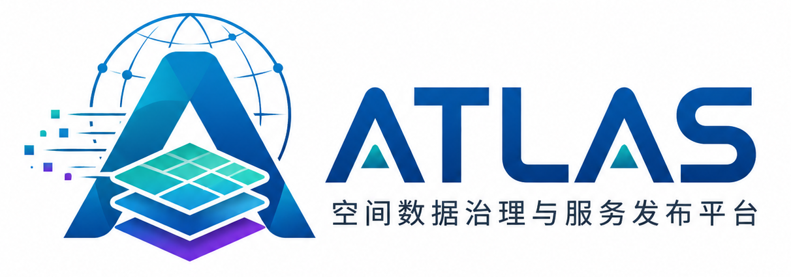
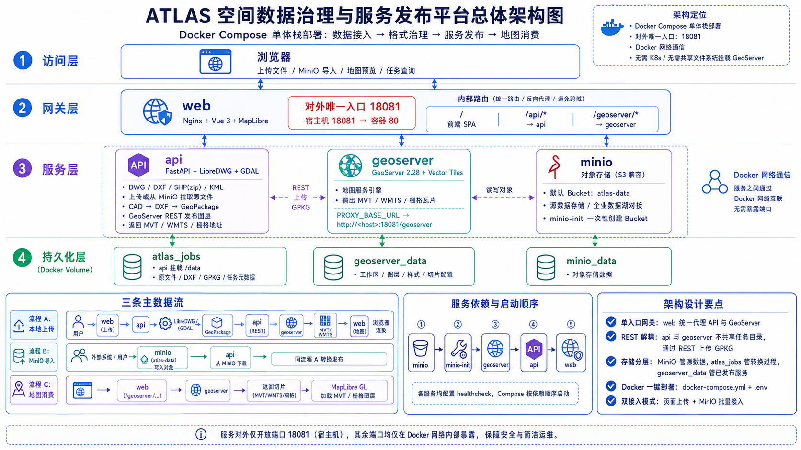
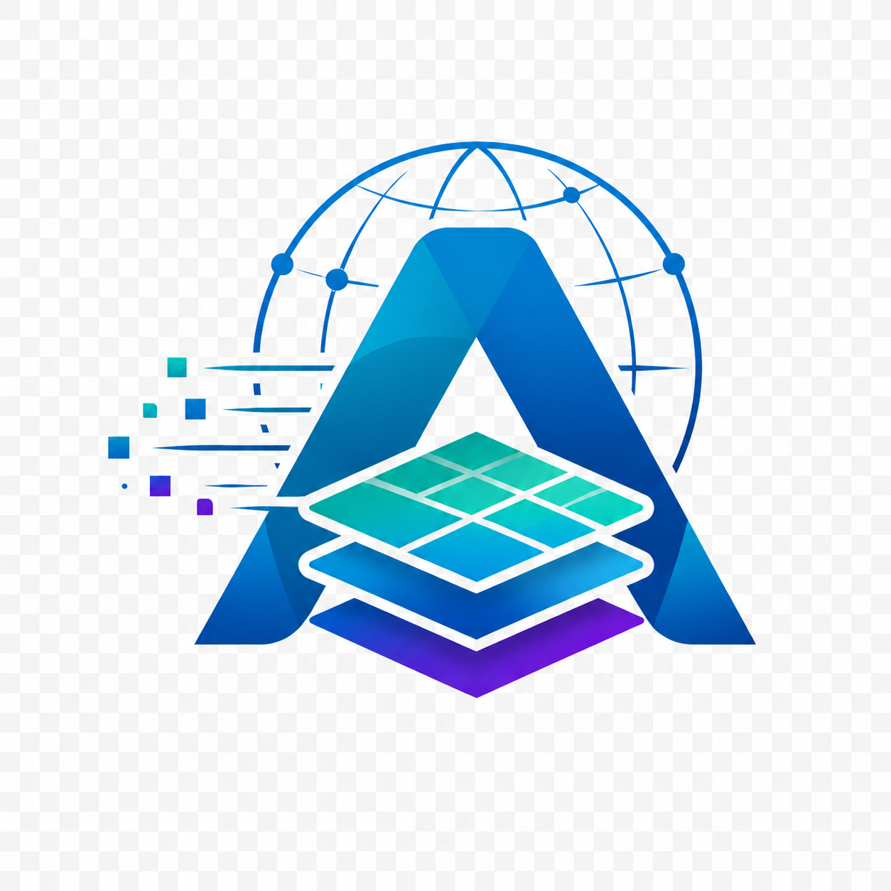

<p align="center">
  <a href="./README.md">中文</a> ·
  <a href="./README.en.md"><strong>English</strong></a>
</p>

<p align="center">
  <a href="https://github.com/Xu1Aan/ATLAS">
    
  </a>
</p>

<p align="center">
  
</p>

<p align="center">
  🌍 A one-stop Dockerized platform for CAD / GIS data governance and map service publishing<br />
  📤 Upload or import from MinIO → 🔄 Auto-convert to GeoPackage → 🗺️ Publish MVT / WMTS map services
</p>

<p align="center">
  <a href="#-about-atlas">About</a> ·
  <a href="#-architecture">Architecture</a> ·
  <a href="#-highlights">Highlights</a> ·
  <a href="#-use-cases">Use Cases</a> ·
  <a href="#-deliverables">Deliverables</a> ·
  <a href="#-tech-stack">Tech Stack</a> ·
  <a href="#-capabilities">Capabilities</a> ·
  <a href="#-quick-start">Quick Start</a> ·
  <a href="#-usage">Usage</a> ·
  <a href="#-production">Production</a> ·
  <a href="#-faq">FAQ</a> ·
  <a href="#-contact">Contact</a> ·
  <a href="#-more-docs">Docs</a>
</p>

---

## 📌 About ATLAS

**ATLAS** (Spatial Data Governance and Service Publishing Platform) addresses a common pain point in engineering and GIS: CAD drawings, Shapefiles, KML, and similar formats are scattered and hard to browse on the Web. Traditional setups require installing LibreDWG, GDAL, GeoServer, and other components on every machine, which is costly to deploy and maintain.

ATLAS packages these capabilities into a **full Docker stack**. With a single Compose command, you get the complete pipeline from **data ingestion, format conversion, service publishing, to map preview**. The platform supports two data sources—browser upload and MinIO object storage batch import. Conversion output uses **GeoPackage** as the standard intermediate format, then **GeoServer** publishes **MVT vector tiles** and **WMTS / raster** services for frontends or third-party systems.

**Who is it for?** Teams in engineering design, surveying & mapping, smart cities, or campus informatization who need to publish CAD or GIS data as Web map services quickly, without maintaining a complex multi-component install. Teams with existing MinIO / object storage can use ATLAS as a lightweight **spatial data governance node** in their data pipeline.

**Compared to traditional approaches**, ATLAS unifies conversion tools, map server, object storage, and Web frontend in one Compose stack. It reduces cross-machine path mounts, manual GeoServer layer setup, and frontend/backend URL mismatches, shortening time from raw files to browsable map services.

---

## 🏗️ Architecture

ATLAS uses a **Docker Compose monolithic stack**: all services run in one Compose project and communicate over the Docker internal network. Only **web** maps a host port (default `18081`); other services stay internal for security and simpler ops.

**api** and **geoserver** exchange GeoPackage via **REST API**, not shared disk paths—a more robust decoupling in containers and easier future scaling of GeoServer. MinIO is optional but built-in as a **source data store**, so the platform runs standalone or plugs into enterprise object storage.

<p align="center">
  
</p>

<p align="center"><sub>📊 ATLAS overall architecture · Access / Gateway / Services / Persistence</sub></p>

The stack has four layers top to bottom:

- **Access layer**: Users browse the Web UI for upload, import, job query, and map preview; REST API is also available for integration.
- **Gateway layer**: Nginx terminates HTTP and routes to static frontend, API, or GeoServer under one entry point.
- **Service layer**: api handles conversion and publishing; geoserver serves maps; minio stores source files; minio-init creates the default bucket on first start.
- **Persistence layer**: Three Docker volumes hold job data, GeoServer config, and MinIO objects—data survives container rebuilds.

| Volume | Mounted by | Contents |
|:---|:---|:---|
| 💼 `atlas_jobs` | api | Uploaded sources, intermediate DXF/GPKG, job metadata |
| 🗺️ `geoserver_data` | geoserver | Workspace (default `atlas`), layers, styles, tile config |
| 🗄️ `minio_data` | minio | All object storage binaries |

| Service | Role | External exposure |
|:---|:---|:---|
| 🌐 **web** | Vue frontend + Nginx reverse proxy for API and GeoServer | Host `:18081` ✅ |
| ⚙️ **api** | Upload/MinIO import, LibreDWG/GDAL conversion, GeoServer REST publishing, job lifecycle | Internal only 🔒 |
| 🗺️ **geoserver** | GeoServer 2.28 MVT, WMTS, raster; Vector Tiles plugin included | Via web `/geoserver` proxy |
| 🗄️ **minio** | S3-compatible storage; minio-init creates `atlas-data` bucket | Internal only 🔒 |

**Startup order**: minio healthy → minio-init → geoserver healthcheck → api → web.

> 📖 For startup order, data flows, and troubleshooting, see **[assets/README.md](./assets/README.md)** (Chinese; English overview in this file).

---

## ✨ Highlights

Beyond “it converts files”, ATLAS focuses on **deployable, integrable, previewable** workflows:

| | Highlight | Description |
|:---:|:---|:---|
| 🐳 | **One-command Docker deploy** | `docker compose up` starts MinIO, GeoServer, API, and Web; LibreDWG and GDAL are in the image |
| 📐 | **Unified multi-format governance** | DWG, DXF, SHP (ZIP), KML → standard GeoPackage |
| 🚀 | **Auto map publishing** | GeoServer REST creates workspace, datastore, and layers after conversion |
| 🔗 | **Dual ingestion modes** | Web upload for quick tests; MinIO bucket/object for enterprise pipelines |
| 🌐 | **Single-port gateway** | All traffic on `:18081`; `/api` and `/geoserver` same-origin, fewer CORS/tile URL issues |
| 🖥️ | **Built-in map preview** | Vue 3 + MapLibre GL loads MVT or raster layers when jobs complete |

> 📍 **Gauss–Krüger coordinates**: For zone-less GK used in China, the platform can add zone and project to WGS84. See [gauss-kruger.md](./services/api/docs/gauss-kruger.md).

---

## 🎯 Use Cases

| Scenario | Description |
|:---|:---|
| 📋 **CAD on the Web** | Publish DWG/DXF for browser zoom/pan/overlay in reviews and demos |
| 🗄️ **MinIO batch governance** | Pull files from object storage on demand in existing data lakes |
| 📦 **Containerized delivery** | Ship full capability as images for POC, demo, or intranet |
| 🏢 **Intranet GIS hub** | Lightweight node with a single exposed Web port for firewall-friendly deployment |

Scenarios often combine: batch DWG into MinIO → ATLAS convert/publish → consume MVT/WMTS in Web or third-party GIS.

---

## 🎁 Deliverables

After a successful job:

| Output | Description | Typical users |
|:---|:---|:---|
| 🗺️ **MVT vector tiles** | Mapbox Vector Tiles for smooth Web rendering of CAD linework | Frontend, Web GIS |
| 🖼️ **WMTS / raster** | For SHP rasterization or CAD-heavy labels | Traditional GIS clients |
| 📦 **GeoPackage** | OGC vector container; downloadable via API for QGIS/ArcGIS | Analysts, surveyors |
| 📋 **Job metadata** | job_id, filename, status, layers, BBox via REST | Integration, ops |
| 🌐 **GeoServer layers** | Persisted in workspace; survive restarts at `/geoserver` | Long-running services |

CAD data prefers **MVT** for interaction; SHP may offer vector and raster depending on source and styling.

---

## 🔧 Tech Stack

| Layer | Technology | Purpose |
|:---|:---|:---|
| 🖥️ Frontend | Vue 3 · TypeScript · MapLibre GL | Upload, MinIO import, job list, map preview |
| 🌐 Gateway | Nginx | Static assets; proxy `/api/*`, `/geoserver/*` |
| ⚙️ Backend | FastAPI · Python 3.11 | Job orchestration, REST API, GeoServer REST |
| 📐 Conversion | LibreDWG · GDAL | DWG→DXF→GeoPackage and CRS handling |
| 🗺️ Maps | GeoServer 2.28 · Vector Tiles | MVT, WMTS, raster tiles |
| 🗄️ Storage | MinIO | S3-compatible source files; default bucket `atlas-data` |
| 🐳 Deploy | Docker Compose | Services, healthchecks, env, volumes |

---

## 🛠️ Capabilities

### 📁 Supported formats

| Format | Notes |
|:---|:---|
| 📄 `.dwg` / `.dxf` | CAD; DWG via LibreDWG → DXF → GeoPackage |
| 🗜️ `.zip` | Shapefile bundle (.shp/.dbf/.shx, etc.) |
| 📍 `.kml` | KML vector → GeoPackage |

Extension-based routing is automatic. For DWG compatibility issues, export DXF from CAD first.

### 📥 Ingestion modes

| Mode | Entry | Use case |
|:---|:---|:---|
| ⬆️ **Local upload** | Web upload | Single-file validation, demos |
| ☁️ **MinIO import** | Web panel or `POST /api/convert/minio` | ETL, schedulers, batch jobs |

### ⚡ Processing pipeline

```
Source (DWG/DXF/SHP/KML)
    → LibreDWG / GDAL
    → GeoPackage
    → GeoServer REST
    → MVT / WMTS
    → Web preview or API consumers
```

### 🔄 Job lifecycle

| Status | Meaning |
|:---|:---|
| `pending` | Created, waiting |
| `converting` | LibreDWG / GDAL running |
| `publishing` | Publishing to GeoServer |
| `done` | MVT/WMTS and GPKG available |
| `error` | Failure; see API or UI message |

Jobs persist in `atlas_jobs`; history available via `GET /api/jobs` and the UI dropdown.

### 📂 Project layout

```text
atlas/
├── docker-compose.yml      # Single deploy entry
├── .env.example            # Env template → copy to .env
├── assets/                 # Logo, architecture diagram, ops docs
└── services/
    ├── api/                # FastAPI conversion & GeoServer publishing
    ├── web/                # Vue frontend + Nginx gateway
    └── geoserver/          # GeoServer image with Vector Tiles plugin
```

---

## 🚀 Quick Start

### 📋 Requirements

| Item | Requirement |
|:---|:---|
| 🐳 Docker | Engine 24+ |
| 📦 Compose | Compose v2 (`docker compose`) |
| 💾 Memory | ≥ 4 GB recommended; GeoServer first start may take 1–2 min |
| 💽 Disk | Volumes grow with uploads and published layers |

On Windows, WSL2 or Linux VM is recommended for I/O; macOS/Linux use Docker Desktop or native Engine.

### 👣 Three steps

```bash
# 1 Copy env template
cp .env.example .env

# 2 Edit .env
#    Change MINIO_ROOT_PASSWORD, APP_GEOSERVER_PASSWORD in production
#    Set APP_GEOSERVER_PUBLIC_URL if not using localhost

# 3 Build and start
docker compose up --build -d
```

First build compiles LibreDWG in the api image and **may take several minutes**. Run `docker compose ps` until services are **healthy**.

### 🌐 URLs

| Purpose | URL |
|:---|:---|
| 🖥️ ATLAS Web UI | http://localhost:18081/ |
| 💚 API health | http://localhost:18081/api/healthz |
| 🗺️ GeoServer console | http://localhost:18081/geoserver/web/ |

> 💡 **Ports & accounts**: Host port from `ATLAS_HOST_PORT` in `.env` (default `18081`). **ATLAS login** defaults to username `admin` / password `admin` (demo frontend gate only; `/api` is not token-protected). GeoServer: `APP_GEOSERVER_USER` / `APP_GEOSERVER_PASSWORD`. MinIO: `MINIO_ROOT_USER` / `MINIO_ROOT_PASSWORD`.

---

## 📖 Usage

### 🎬 First run (local upload)

1. 🌐 Open http://localhost:18081/
2. 🔐 Log in with **admin** / **admin** (captcha required)
3. 📤 Upload DWG, DXF, SHP (zip), or KML
4. ⏳ Wait until the job completes; switch jobs in the history dropdown
5. 🗺️ Map loads MVT or raster; pan, zoom, toggle layers

If MVT is unavailable, download GPKG from the hint link. Large DWG files may take minutes.

### ☁️ MinIO import

Upload source to `atlas-data` (or configured bucket), then:

```bash
curl -X POST "http://localhost:18081/api/convert/minio" \
  -H "Content-Type: application/json" \
  -d '{"bucket_name":"atlas-data","object_name":"samples/demo.dwg"}'
```

Or use the MinIO panel in the UI. Poll `GET /api/convert/{job_id}` for MVT/WMTS URLs.

### 🔌 Common API

| Method | Path | Description |
|:---|:---|:---|
| `POST` | `/api/convert` | Multipart upload; returns `job_id` |
| `POST` | `/api/convert/minio` | Convert object from MinIO |
| `GET` | `/api/jobs` | Job list |
| `GET` | `/api/convert/{job_id}` | Status, errors, MVT/WMTS URLs |
| `GET` | `/api/convert/{job_id}/gpkg` | Download GeoPackage |

---

## 🏭 Production notes

**Security**

- Change default MinIO and GeoServer passwords in `.env`.
- Only port `18081` is exposed by default; avoid mapping MinIO 9000/9001 publicly.
- Put HTTPS reverse proxy (Nginx/Traefik) in front for public/DMZ deploy; update `APP_GEOSERVER_PUBLIC_URL` to HTTPS.

**Performance**

- GeoServer and api are CPU/memory sensitive; ≥ 8 GB for large files or concurrency.
- Monitor `atlas_jobs`, `geoserver_data`, `minio_data` volume usage.

**URLs**

- `APP_GEOSERVER_PUBLIC_URL` must match the **browser-reachable** GeoServer base (scheme, host, port, `/geoserver` path) or tiles may fail.

---

## ✅ Verification

```bash
docker compose ps
curl http://localhost:18081/api/healthz
```

| Check | Expected |
|:---|:---|
| Health | HTTP 200, `{"status":"ok"}` |
| Containers | `api`, `geoserver`, `minio` **healthy**; `web` running |
| UI | Login page and workbench render without errors |
| Trial upload | Small DXF/KML completes and map responds |

---

## 🛠️ Ops commands

```bash
docker compose logs -f api
docker compose logs -f geoserver
docker compose restart
docker compose down
docker compose down -v   # ⚠️ deletes volumes
docker volume ls | grep atlas
```

---

## ❓ FAQ

| Symptom | Likely cause | Action |
|:---|:---|:---|
| 🔐 **Login / forgot password** | Demo fixed credentials | Default **admin** / **admin**; use enterprise SSO in production |
| 🗺️ **Blank map** | Wrong tile URL | Check `/geoserver/...` in DevTools; fix `APP_GEOSERVER_PUBLIC_URL` |
| ☁️ **MinIO import fails** | Bucket/key/credentials | Ensure `minio-init` ran and `atlas-data` exists; match `.env` keys |
| ⏳ **GeoServer slow start** | First-time init | Wait 1–2 min; see `docker compose logs geoserver` |
| 📐 **Coordinate shift** | GK zone mismatch | Adjust `APP_GAUSS_KRUGER_ZONE` (default 39); see [gauss-kruger.md](./services/api/docs/gauss-kruger.md) |
| 🔴 **api not healthy** | Dependencies not ready | `docker compose ps`; `docker compose logs api` |
| 📄 **DWG fails** | Unsupported DWG version | Save as older DWG or export DXF |
| 🔁 **History map fails** | Layer/volume lost | Confirm `geoserver_data` volume; re-upload if needed |

More troubleshooting: [assets/README.md](./assets/README.md).

---

## 👤 Contact

| | |
|:---|:---|
| 🐙 **GitHub** | [https://github.com/Xu1Aan/ATLAS](https://github.com/Xu1Aan/ATLAS) |
| 👨‍💻 **Maintainer** | 徐岸 (Xu An) |
| 📧 **Email** | [toxuan1998@qq.com](mailto:toxuan1998@qq.com) |

See **[AUTHORS.md](./AUTHORS.md)** and API `/` / Swagger for maintainer info.

---

## 📚 More documentation

| Document | Contents |
|:---|:---|
| 🐙 **[GitHub Repository](https://github.com/Xu1Aan/ATLAS)** | Source code, issues, and contributions |
| 🌐 **[README.md](./README.md)** | Chinese project overview (switch language at top) |
| 📘 **[assets/README.md](./assets/README.md)** | Full architecture, env table, flows, backup (Chinese) |
| 👤 **[AUTHORS.md](./AUTHORS.md)** | Maintainers |
| 📐 **[services/api/docs/gauss-kruger.md](./services/api/docs/gauss-kruger.md)** | Gauss–Krüger zone config |
| ⚙️ **[.env.example](./.env.example)** | Environment variables |

---

## 📄 Open source

Application code is provided as open source. Upstream components use their own licenses:

| Component | License |
|:---|:---|
| LibreDWG | GPLv3 |
| GDAL | MIT |
| GeoServer | GPLv2 |
| MinIO | AGPLv3 |

---

<p align="center">
  
  <br />
  <sub><strong>ATLAS</strong> · CAD / GIS data at your fingertips 🌍</sub>
  <br />
  <sub>徐岸 · <a href="mailto:toxuan1998@qq.com">toxuan1998@qq.com</a></sub>
</p>
