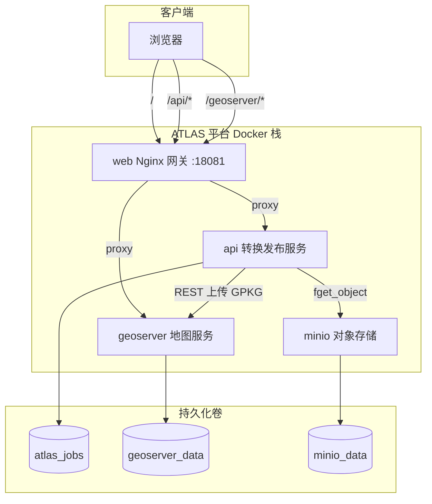

# ATLAS 空间数据治理与服务发布平台

ATLAS 是一套面向 CAD / GIS 源数据的 **Docker 化空间数据治理与服务发布平台**。平台将 DWG、DXF、SHP（ZIP）、KML 等格式统一转换为 GeoPackage，经 GeoServer 发布为 **MVT 矢量切片** 与 **WMTS / 栅格** 服务，并通过 Web 前端进行上传、任务管理与地图预览。

---

## 总体架构图



### 组件职责

| 组件 | 镜像 / 构建 | 职责 |
|------|-------------|------|
| **web** | `services/web` | 静态前端 + Nginx 反向代理，对外唯一入口 |
| **api** | `services/api` | FastAPI：LibreDWG + GDAL 转换、GeoServer REST 发布、MinIO 拉取 |
| **geoserver** | `services/geoserver` | GeoServer 2.28 + Vector Tiles 插件，地图服务引擎 |
| **minio** | `minio/minio` | S3 兼容对象存储，存放待转换源文件 |
| **minio-init** | `minio/mc` | 一次性初始化默认 Bucket |

### 数据流

1. **本地上传**：浏览器 → web → api → LibreDWG/GDAL → GeoPackage → GeoServer REST → MVT / WMTS
2. **MinIO 导入**：api 从 MinIO 下载对象 → 同上转换发布流程（`POST /api/convert/minio`）
3. **地图展示**：浏览器经 web 反代访问 `/geoserver/...` 加载切片

---

## 快速开始

### 环境要求

- Docker Engine 24+
- Docker Compose v2
- 可用内存建议 ≥ 4 GB（GeoServer 首次启动较慢）

### 启动

```bash
cp .env.example .env
# 编辑 .env，至少修改 MINIO_ROOT_PASSWORD 与 APP_GEOSERVER_PASSWORD

docker compose up --build -d
docker compose ps
```

### 访问地址

| 服务 | 地址 |
|------|------|
| ATLAS 前端 | `http://<host>:18081/` |
| API 健康检查 | `http://<host>:18081/api/healthz` |
| GeoServer 控制台 | `http://<host>:18081/geoserver/web/` |
| MinIO API（容器内） | `http://minio:9000` |

> MinIO Console（9001）默认未映射到宿主机。如需管理界面，可在 `docker-compose.yml` 中为 minio 服务增加 `ports: "9001:9001"`。

---

## 环境变量

根目录 `.env` 由 Compose 自动加载。完整模板见 [`.env.example`](../.env.example)。

| 变量 | 默认值 | 说明 |
|------|--------|------|
| `ATLAS_HOST_PORT` | `18081` | Web 网关宿主机端口 |
| `MINIO_ROOT_USER` | `minioadmin` | MinIO 访问密钥（同步至 api） |
| `MINIO_ROOT_PASSWORD` | `changeme` | MinIO 密钥，**生产务必修改** |
| `MINIO_DEFAULT_BUCKET` | `atlas-data` | 初始化创建的默认 Bucket |
| `APP_GEOSERVER_USER` | `admin` | GeoServer 管理员 |
| `APP_GEOSERVER_PASSWORD` | `geoserver` | GeoServer 密码 |
| `APP_GEOSERVER_WORKSPACE` | `atlas` | GeoServer 工作区名称 |
| `APP_GEOSERVER_PUBLIC_URL` | `http://localhost:18081/geoserver` | 浏览器可见的 GeoServer 基址 |
| `APP_GAUSS_KRUGER_ZONE` | `39` | 高斯-克吕格投影带号 |
| `APP_ENABLE_GAUSS_KRUGER_TRANSFORM` | `true` | 是否启用高斯-克吕格变换 |

容器内固定（无需配置）：

- `APP_GEOSERVER_URL=http://geoserver:8080/geoserver`
- `APP_MINIO_ENDPOINT=http://minio:9000`

---

## 典型使用流程

### 本地上传

1. 打开 `http://<host>:18081/`
2. 选择 DWG / DXF / SHP(zip) / KML 文件上传
3. 等待转换完成，地图自动加载 MVT / 栅格图层

### 从 MinIO 导入

1. 使用 MinIO 客户端或 Console 将源文件上传至 Bucket（默认 `atlas-data`）
2. 在前端「MinIO 导入」面板填写 Bucket 与 Object Key
3. 或调用 API：

```bash
curl -X POST "http://localhost:18081/api/convert/minio" \
  -H "Content-Type: application/json" \
  -d '{"bucket_name":"atlas-data","object_name":"samples/demo.dwg"}'
```

### 查询任务

```bash
curl http://localhost:18081/api/jobs
curl http://localhost:18081/api/convert/{job_id}
```

---

## 项目结构

```text
atlas/
├── docker-compose.yml       # 唯一部署入口
├── .env.example
├── assets/                  # 品牌资源与本主文档
├── services/
│   ├── api/                 # FastAPI 转换与发布服务
│   ├── web/                 # Vue 3 + MapLibre 前端
│   └── geoserver/           # GeoServer 自定义镜像
└── README.md                # 快速入口
```

---

## 持久化与备份

| Docker Volume | 内容 |
|---------------|------|
| `atlas_jobs` | 上传文件、中间 DXF/GPKG、任务元数据 |
| `geoserver_data` | GeoServer 工作区、样式、已发布图层 |
| `minio_data` | MinIO 对象数据 |

常用命令：

```bash
docker compose down          # 停止服务，保留卷
docker compose down -v       # 停止并删除所有卷（慎用）
docker volume ls | grep atlas
```

---

## 故障排查

```bash
docker compose logs -f api
docker compose logs -f geoserver
docker compose logs -f minio
docker compose logs minio-init
```

| 现象 | 排查建议 |
|------|----------|
| api 无法启动 | 确认 geoserver 已 healthy；查看 LibreDWG/GDAL 日志 |
| MinIO 导入失败 | 检查 Bucket 是否存在、凭证是否与 `.env` 一致 |
| 地图空白 | 打开浏览器开发者工具，确认 `/geoserver/...` 切片 URL 可访问 |
| GeoServer 链接错误 | 确认 `APP_GEOSERVER_PUBLIC_URL` 与真实访问地址一致 |

api 启动日志会输出 `dwg2dxf`、`ogr2ogr` 可执行文件路径，便于确认依赖可用。

---

## 附录

### 支持格式

- `.dwg`、`.dxf`、`.kml`、`.zip`（SHP 压缩包）

### 高斯-克吕格投影

详见 [services/api/docs/gauss-kruger.md](../services/api/docs/gauss-kruger.md)。

### 依赖许可

| 组件 | 许可 |
|------|------|
| LibreDWG | GPLv3 |
| GDAL | MIT |
| GeoServer | GPLv2 |
| MinIO | AGPLv3 |

---

<p align="center">
  
  <br />
  <sub>维护者 徐岸 · <a href="mailto:toxuan1998@qq.com">toxuan1998@qq.com</a></sub>
</p>
