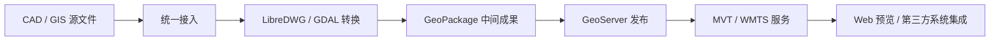

# ATLAS 平台推广文案

## 为 CAD / GIS 数据提供更稳妥的 Web 化路径

在工程设计、测绘地理信息、园区管理、智慧城市建设等场景中，DWG、DXF、SHP、KML 等空间数据一直都很重要。但在不少团队的实际工作流里，这些数据仍然更多以“文件”的形式存在，距离稳定的 Web 展示、标准化服务发布和跨系统复用，往往还有一段不短的路要走。

一方面，CAD 图纸和 GIS 数据格式多样、来源复杂、坐标体系不完全统一，难以直接在浏览器或业务系统中使用；另一方面，如果希望把这些数据进一步发布成标准地图服务，通常又需要分别部署和维护 LibreDWG、GDAL、GeoServer、对象存储、前端地图预览等多套组件，实施与运维成本都不低。

**ATLAS** 希望在这样的场景中，提供一套相对完整、部署成本较低、便于团队逐步落地的空间数据治理与地图服务发布方案。

它将 **数据接入、格式转换、标准化治理、地图服务发布、Web 端预览** 串联成一条尽量顺滑的链路，并通过 Docker 进行统一封装，帮助团队在不过多增加环境维护负担的前提下，把分散的 CAD / GIS 数据逐步转化为可访问、可集成、可复用的服务资源。

> 上图为项目内现有切片预览示意，适合作为文档中的展示配图。若后续补充系统首页截图、任务列表截图或架构图，整体呈现会更完整。

## ATLAS 是什么

ATLAS 是一套面向 CAD / GIS 源数据的 Docker 化平台，主要希望帮助团队完成以下工作：

- 接入多源空间数据，包括 DWG、DXF、SHP（ZIP）和 KML
- 自动将异构格式转换为统一的 GeoPackage 标准中间数据
- 通过 GeoServer 发布为 MVT 矢量切片与 WMTS / 栅格服务
- 通过内置 Web 前端完成上传、任务管理与地图预览
- 支持本地上传和 MinIO 对象存储导入两类数据入口

简单来说，ATLAS 不只是一个单点转换工具，更接近一套围绕空间数据服务化的基础能力组合。它关注的不只是“文件能不能转”，也包括“结果如何发布、如何被系统消费、如何减少重复建设”。

## 它希望缓解哪些实际问题

### 1. 空间数据格式分散，治理链路不统一

很多企业和项目现场会同时存在 CAD 图纸、Shapefile、KML、历史批处理成果等多种数据源。数据格式不同、坐标定义不同、加工流程不同，导致每次接入新系统时都要重新梳理一次。

ATLAS 通过统一的后端转换链路，将这类异构空间数据转为标准 GeoPackage，帮助团队建立相对稳定的数据中间层，为后续展示、共享和系统集成打下基础。

### 2. CAD 图纸不容易直接进入 Web 场景

DWG / DXF 文件天然更适合桌面设计软件环境，而不是直接用于浏览器端交互。很多团队为了实现图纸上网展示，不得不额外开发格式转换工具、服务接口和前端渲染逻辑，投入不小，而且容易出现重复建设。

ATLAS 内置从 CAD 数据到 GeoPackage、再到 MVT 矢量切片的处理链路，让 CAD 图纸能够以更自然的方式进入 Web GIS 场景，支持在浏览器中进行缩放、平移、图层浏览和集成展示。

### 3. 多组件部署复杂，环境维护压力较大

传统方案中，空间数据服务化往往依赖多个独立组件协同工作，例如格式转换工具、地图服务引擎、对象存储和前端预览系统。即使单个组件本身成熟，组合起来之后的环境安装、版本兼容、依赖调试和运维巡检，依然会给团队带来不小负担。

ATLAS 采用 Docker Compose 方式统一交付，把核心能力封装进容器中。团队不必在每台宿主机上分别安装 LibreDWG、GDAL、GeoServer 等依赖，通常可以更快完成环境搭建，也更容易实现测试、部署与迁移。

### 4. 数据“能够转换”并不等于“方便服务”

很多项目已经有一些零散的格式转换脚本，但真正落地到业务系统时，还要继续面对服务发布、地址生成、前端消费、任务状态查询和结果回溯等问题。没有统一平台时，这些环节通常依赖人工串联，效率不高，也容易出错。

ATLAS 将“转换”和“发布”尽量打通，文件处理完成后可以直接得到 MVT / WMTS 服务地址，同时保留 GeoPackage 结果，便于进入下游业务系统或第三方 GIS 平台。

## ATLAS 的主要能力

### 多源数据接入

ATLAS 支持以下常见空间数据格式：

- `.dwg`
- `.dxf`
- `.zip`（SHP 压缩包）
- `.kml`

平台支持两种典型接入方式：

- **浏览器本地上传**：适合人工操作、临时发布、项目演示和日常业务使用
- **MinIO 对象存储导入**：适合自动化流程、批量处理、系统对系统接入

对于已经建设对象存储体系的企业来说，ATLAS 可以作为现有数据中台或数据流水线中的空间数据处理节点，减少人工搬运文件的步骤。

### 统一格式转换

ATLAS 将 GeoPackage 作为标准中间成果格式，这一设计比较关键。

GeoPackage 具备较好的开放性、标准化能力和跨工具兼容性，既便于平台内部处理，也方便后续在 QGIS、GeoServer 或其他 GIS 工具中继续使用。通过统一中间格式，ATLAS 尝试把前端接入方式多样、上游源数据复杂的问题，转化为更可控的标准化处理流程。

对于 DWG 数据，平台会通过 LibreDWG 与 GDAL 构建转换链路；对于其他 GIS 数据，也会按对应格式选择处理路径。这种自动路由方式有助于降低使用门槛，让非 GIS 开发人员也能更容易参与数据上云与服务化流程。

### 标准地图服务发布

ATLAS 集成 GeoServer，并支持将转换结果发布为：

- **MVT 矢量切片服务**
- **WMTS / 栅格瓦片服务**

其中，MVT 更适合现代 Web 地图应用，具有传输轻、渲染快、交互流畅等特点，尤其适合 CAD 图纸中的线面数据浏览。WMTS / 栅格服务则更适用于传统 GIS 客户端接入、栅格化展示场景，或对固定样式输出有要求的系统。

这意味着同一份空间数据，不再只是一个“转换后的文件”，而是有机会进一步成为标准服务接口，被前端地图、业务系统、行业平台乃至第三方 GIS 软件复用。

### 内置 Web 工作台

平台内置基于 Vue 3 与 MapLibre GL 的 Web 前端，具备以下能力：

- 文件上传
- MinIO 导入
- 任务状态管理
- 结果列表查看
- 地图自动预览
- 矢量或栅格图层加载

对于很多团队来说，这一点会比较实用。ATLAS 不只提供后端引擎，也提供可直接使用的操作界面，便于业务人员、项目经理、实施人员和技术团队围绕同一平台协作。

### 容器化交付

ATLAS 的一个实际价值，在于它比较适合企业环境中的标准化部署。

平台通过 Docker Compose 管理多个核心服务，包括 MinIO、GeoServer、API 和 Web。这样做通常会带来一些直接好处：

- 环境搭建更快
- 依赖版本更稳定
- 跨机器迁移更容易
- 测试、演示、生产环境更容易保持一致
- 后续扩展和集成成本更可控

对于想较快验证空间数据服务化方案的团队，ATLAS 有助于缩短 PoC 到正式落地之间的周期。

## 典型应用场景

### CAD 图纸 Web 化展示

在设计院、施工单位、业主方或项目汇报场景中，工程图纸常常需要被更多非专业设计软件用户查看。ATLAS 可以帮助团队把 DWG / DXF 转换并发布为 Web 地图服务，让图纸内容在浏览器中直接浏览、缩放、叠加和共享，降低查看门槛，改善协同效率。

### 园区与城市空间数据治理

在智慧园区、智慧工地、城市治理、地下管网、资产管理等项目中，常常需要整合来自不同部门和不同阶段的空间数据。ATLAS 可以作为相对轻量的治理节点，把多源数据转为统一成果并发布标准服务，提升数据复用率，减少重复加工。

### 企业 GIS 中台的数据接入节点

如果企业已经有门户、业务系统、地图中台或数据中台，ATLAS 可以作为其中的一个标准化数据接入层，专门承接 CAD / GIS 文件导入、转换和地图服务发布任务。通过统一输出 MVT / WMTS 地址，可以更方便地对接已有系统。

### 对象存储驱动的批量发布流程

对于具备 MinIO 或其他对象存储体系的团队，上游系统可以先将 DWG、SHP、KML 等文件写入对象存储，再由调度系统调用 ATLAS API 发起处理。这样，ATLAS 就能融入自动化数据流水线，更适合承接企业级场景中的批处理和持续发布需求。

## 为什么可以考虑 ATLAS

### 1. 更关注服务交付，而不只是文件转换

ATLAS 关注的不是单纯把文件转成另一种文件，而是尽量帮助团队得到能被系统调用、能被前端加载、能被业务消费的地图服务成果。

### 2. 有助于降低 CAD / GIS 数据服务化门槛

对于很多团队来说，空间数据服务化最大的阻碍不是需求不存在，而是实施难度高。ATLAS 把复杂的组件链路进行封装，希望让更多团队可以以更低门槛启动这项能力建设。

### 3. 同时兼顾人工操作与系统集成

平台既支持浏览器上传，也支持对象存储导入；既适合单次操作，也适合自动化流水线；既能满足演示和试点，也能支撑后续系统化建设。

### 4. 基于成熟开源技术栈构建

ATLAS 基于 Vue 3、FastAPI、GeoServer、LibreDWG、GDAL、MinIO、MapLibre GL 等成熟开源组件构建，兼顾可维护性与生态兼容性，更适合在真实项目中逐步落地。

### 5. 既可以独立使用，也便于嵌入现有体系

ATLAS 可以直接作为一个可操作的平台使用，也可以作为已有系统背后的空间数据能力底座。无论是独立部署，还是嵌入现有架构，都保留了较好的适配空间。

## 对客户和团队可能带来的价值

如果部署方式和使用场景匹配，团队通常能在以下几个方面获得较直接的收益：

- 缩短 CAD / GIS 数据上线周期
- 减少人工格式整理和重复转换工作
- 降低空间数据服务发布的技术门槛
- 提高图纸与地理数据的可视化共享效率
- 为后续系统集成提供统一服务接口
- 让历史空间数据资产获得再次利用的机会

对于项目型组织而言，这意味着更顺畅的交付；对于平台型组织而言，这意味着更高复用；对于运维与管理方而言，这意味着更清晰、可持续的数据服务体系。

## 一句话总结

**ATLAS 是一套面向 CAD / GIS 源数据的 Docker 化平台，用于帮助团队将 DWG、DXF、SHP、KML 等空间数据逐步转化为更易发布、预览与集成的标准地图服务能力。**

如果你的团队正在寻找一条更轻量、更标准、也更容易部署的空间数据治理与服务发布路径，ATLAS 可以作为一个值得评估的选择。
